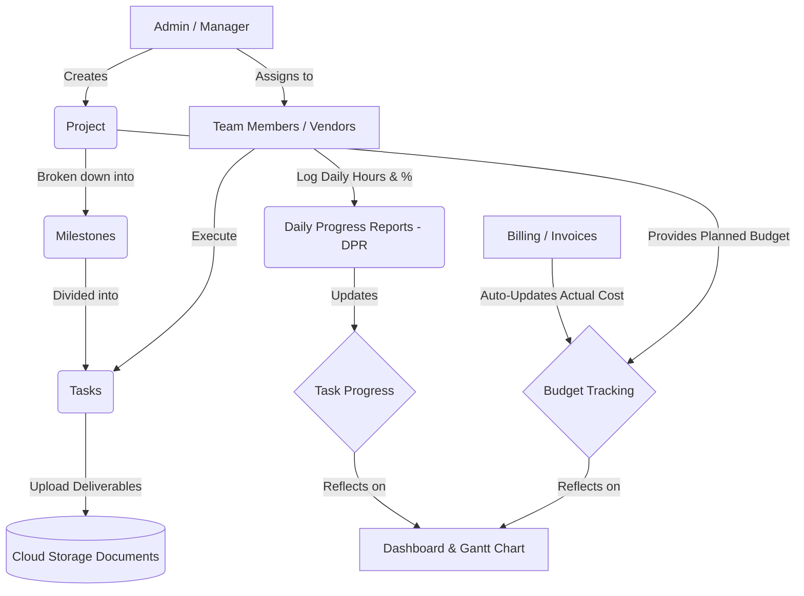

# CRM & Project Management: System Workflow

This document outlines the end-to-end business workflow and user journey within the CRM & Project Management System.

## High-Level Architecture Flow

## Step-by-Step User Workflow

### Phase 1: Project Initiation
1. **Login**: The Project Manager logs in securely using their registered Supabase email and password.
2. **Create Project**: Navigate to the **Projects** screen. Click "+ Add Project". Define the project name, project type (`Internal` or `External`), overall planned budget, and planned timeline.
3. **Team Setup**: Navigate to the **Team** screen. Ensure all internal employees and external vendors who will work on the project are added to the system.

### Phase 2: Planning & Breakdown
1. **Define Milestones**: Creating a project automatically provisions 4 standard milestones (Requirement Gathering, Design, Development, Testing). Users can navigate to the **Milestones** screen to add custom phases.
2. **Assign Tasks**: Navigate to the **Tasks** screen. 
   - Select a Milestone.
   - Create specific tasks.
   - Assign each task to a specific Team Member or External Vendor.
   - Set planned start dates, end dates, and allocated budget for the task.

### Phase 3: Execution & Tracking
1. **Daily Progress (DPR)**: 
   - Team members navigate to the **DPR** screen.
   - They select their assigned tasks and log the hours they worked that day.
   - They update the completion percentage (e.g., "50% done").
2. **Document Management**: 
   - As work is completed, team members upload deliverables (e.g., design files, requirement docs).
   - Documents are uploaded directly inside the **Documents** screen.
   - Files are securely uploaded to the Supabase Cloud bucket and organized by Project > Milestone.

### Phase 4: Financials & Monitoring (Automated)
1. **Billing (Source of Truth)**: 
   - Once milestones are achieved or vendors submit bills, navigate to the **Billing** screen.
   - Enter the Invoice Number, Vendor Name, and **Invoice Amount**.
2. **Budget Monitoring (Automated)**: 
   - Navigate to the **Budget** screen. 
   - The system automatically fetches the total sum of all Billing invoices for a project and displays it as the **Actual Cost**.
   - The **Remaining Budget (Balanced Cost)** is automatically calculated by subtracting the Actual Cost from the manually entered Planned Budget.
3. **Visual Tracking (Gantt)**: 
   - Managers navigate to the **Gantt Chart**.
   - They switch between the `Internal Team` and `External Team` tabs to see a visual timeline of projects filtered perfectly by their Project Type.

### Phase 5: Completion
1. **Project Closure**: Once all tasks hit 100% completion in the DPR, the manager updates the Project Status to "Completed".
2. **Notifications**: (If configured) Automated email notifications are sent out to stakeholders summarizing the project delivery.

---

> [!TIP]
> **Best Practice:** The Budget module requires zero manual calculation. Simply ensure all your project invoices are logged accurately in the Billing module, and the Budget tab will automatically sync the actual costs and calculate your remaining balances!
